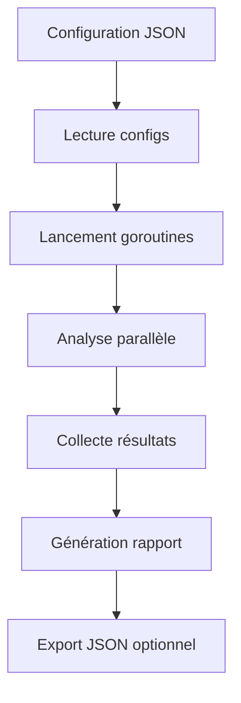

# 📊 Efrei_Tp_loganizer - Documentation Complète

## 📖 Table des matières

- [Vue d'ensemble](#-vue-densemble)
- [Architecture](#-architecture)
- [Installation](#-installation)
- [Configuration](#-configuration)
- [Utilisation](#-utilisation)
- [API](#-api)
- [Gestion d'erreurs](#-gestion-derreurs)
- [Tests](#-tests)
- [Performance](#-performance)
- [Dépannage](#-dépannage)
- [Contribution](#-contribution)

---

## 🎯 Vue d'ensemble

**Efrei_Tp_loganizer** est un analyseur de logs haute performance développé en Go qui traite les fichiers de logs de manière **concurrente** avec une gestion robuste des erreurs personnalisées.

### 🎖️ Fonctionnalités principales

- ✅ **Traitement concurrent** : Analyse multiple logs simultanément
- ✅ **Erreurs personnalisées** : Gestion fine des erreurs avec `errors.As()`
- ✅ **Simulation réaliste** : Délais variables et erreurs aléatoires
- ✅ **Export JSON** : Rapports détaillés exportables
- ✅ **CLI intuitive** : Interface en ligne de commande avec Cobra
- ✅ **Types de logs supportés** : Nginx, MySQL, applications custom

### 📊 Métriques de performance

- **Temps de traitement** : 50-200ms par fichier
- **Concurrence** : Traitement simultané de N fichiers
- **Taux d'erreur simulé** : 10% (configurable)
- **Format de sortie** : JSON structuré

---

## 🏗️ Architecture

### Structure du projet

```
Efrei_Tp_loganizer/
├── 📁 cmd/                    # Interface CLI
│   ├── root.go               # Commande racine Cobra
│   └── analyser.go           # Commande d'analyse
├── 📁 internal/              # Code interne
│   ├── 📁 analyzer/          # Logique d'analyse
│   │   ├── types.go          # Types et erreurs
│   │   └── analyzer.go       # Analyse concurrente
│   └── 📁 reporter/          # Export des résultats
│       └── reporter.go       # Génération de rapports
├── 📁 test_logs/             # Fichiers de test
│   ├── access.log
│   ├── errors.log
│   ├── mysql_error.log
│   ├── empty.log
│   └── corrupted.log
├── 📁 test/                  # Tests
│   └── error_test.go
├── main.go                   # Point d'entrée
├── go.mod                    # Dépendances Go
├── config.json               # Configuration
└── README.md
```

### 🔄 Flux de traitement



---

## 🚀 Installation

### Prérequis

- **Go 1.22.0** ou supérieur
- **Git** (optionnel)

### 1. Clone ou téléchargement

```bash
# Option 1: Clone
git clone https://github.com/votre-username/Efrei_Tp_loganizer.git
cd Efrei_Tp_loganizer

# Option 2: Téléchargement direct
# Téléchargez et décompressez les fichiers
```

### 2. Installation des dépendances

```bash
go mod tidy
```

### 3. Compilation

```bash
# Compilation basique
go build -o loganalyzer .

# Compilation optimisée (optionnel)
go build -ldflags="-s -w" -o loganalyzer .
```

### 4. Vérification

```bash
./loganalyzer --help
```

**Sortie attendue :**
```
A powerful command-line tool to analyze log files from various sources concurrently.

Usage:
  loganalyzer [command]

Available Commands:
  analyze     Analyze log files based on a configuration file
  help        Help about any command

Flags:
  -h, --help   help for loganalyzer
```

---

## ⚙️ Configuration

### Format du fichier de configuration

Le fichier `config.json` définit les logs à analyser :

```json
[
  {
    "id": "identifiant-unique",
    "path": "chemin/vers/fichier.log",
    "type": "type-de-log"
  }
]
```

### Types de logs supportés

| Type | Description | Exemple |
|------|-------------|---------|
| `nginx-access` | Logs d'accès Nginx | `192.168.1.1 - [date] "GET /" 200` |
| `mysql-error` | Logs d'erreur MySQL | `[ERROR] Cannot connect to database` |
| `custom-app` | Application personnalisée | Format libre |
| `generic` | Type générique | Format libre |

### Exemple de configuration

```json
[
  {
    "id": "web-server-1",
    "path": "test_logs/access.log",
    "type": "nginx-access"
  },
  {
    "id": "app-backend-2",
    "path": "test_logs/errors.log",
    "type": "custom-app"
  },
  {
    "id": "db-server-3",
    "path": "test_logs/mysql_error.log",
    "type": "mysql-error"
  }
]
```

---

## 🎮 Utilisation

### Commandes principales

#### 1. Analyse basique

```bash
./loganalyzer analyze --config config.json
```

**Sortie :**
```
Successfully loaded 3 log configurations from config.json.
Starting concurrent analysis...

Analysis completed in 156.789ms
Processed 3 log files

--- Analysis Results ---
ID: web-server-1, Status: SUCCESS, Time: 123ms
ID: app-backend-2, Status: SUCCESS, Time: 87ms
ID: db-server-3, Status: SUCCESS, Time: 156ms

Summary: 3 successful, 0 errors
```

#### 2. Analyse avec export

```bash
./loganalyzer analyze --config config.json --output results.json
```

#### 3. Aide contextuelle

```bash
./loganalyzer analyze --help
```

### Options disponibles

| Flag | Raccourci | Description | Requis |
|------|-----------|-------------|---------|
| `--config` | `-c` | Chemin vers le fichier de configuration | ✅ |
| `--output` | `-o` | Chemin d'export du rapport JSON | ❌ |
| `--help` | `-h` | Affiche l'aide | ❌ |

### Exemples d'usage

#### Analyse de logs de production

```bash
# Configuration production
./loganalyzer analyze -c prod-config.json -o prod-report.json
```

#### Analyse de développement

```bash
# Tests locaux
./loganalyzer analyze -c dev-config.json
```

#### Analyse avec logs spécifiques

```bash
# Création d'une config temporaire
echo '[{"id":"temp","path":"app.log","type":"custom-app"}]' > temp-config.json
./loganalyzer analyze -c temp-config.json
```

---

## 🔌 API

### Package `internal/analyzer`

#### Types principaux

```go
// Configuration d'un fichier de log
type LogConfig struct {
    ID   string `json:"id"`     // Identifiant unique
    Path string `json:"path"`   // Chemin vers le fichier
    Type string `json:"type"`   // Type de log
}

// Résultat d'analyse
type LogResult struct {
    LogID        string `json:"log_id"`
    FilePath     string `json:"file_path"`
    Status       string `json:"status"`        // "SUCCESS" | "ERROR"
    Message      string `json:"message"`
    ErrorDetails string `json:"error_details"`
    ProcessTime  string `json:"process_time"`
}
```

#### Fonctions principales

##### `AnalyzeLogs(configs []LogConfig) []LogResult`

Analyse une liste de configurations de logs de manière concurrente.

**Paramètres :**
- `configs` : Slice de configurations de logs à analyser

**Retour :**
- `[]LogResult` : Résultats d'analyse pour chaque log

**Exemple :**
```go
configs := []analyzer.LogConfig{
    {ID: "web", Path: "access.log", Type: "nginx-access"},
}
results := analyzer.AnalyzeLogs(configs)
```

##### `HandleError(err error)`

Gère les erreurs avec identification du type via `errors.As()`.

**Exemple :**
```go
err := analyzer.FileNotFoundError{Path: "/missing/file.log"}
analyzer.HandleError(err)
// Output: File not found error: /missing/file.log
```

### Package `internal/reporter`

##### `ExportResults(results []analyzer.LogResult, outputPath string) error`

Exporte les résultats vers un fichier JSON.

**Paramètres :**
- `results` : Résultats à exporter
- `outputPath` : Chemin du fichier de sortie

**Retour :**
- `error` : Erreur éventuelle

---

## ❌ Gestion d'erreurs

### Erreurs personnalisées

#### `FileNotFoundError`

Erreur levée quand un fichier de log n'existe pas.

```go
type FileNotFoundError struct {
    Path string
}

func (e FileNotFoundError) Error() string {
    return "file not found: " + e.Path
}
```

**Usage :**
```go
var fileErr analyzer.FileNotFoundError
if errors.As(err, &fileErr) {
    fmt.Printf("Fichier manquant: %s\n", fileErr.Path)
}
```

#### `ParsingError`

Erreur levée lors de problèmes de parsing.

```go
type ParsingError struct {
    Details string
}

func (e ParsingError) Error() string {
    return "parsing error: " + e.Details
}
```

### Stratégie de gestion

1. **Détection** : `errors.As()` pour identifier le type
2. **Logging** : Enregistrement détaillé des erreurs
3. **Continuation** : Le traitement continue malgré les erreurs
4. **Rapport** : Inclusion dans le rapport final

### Cas d'erreurs gérés

| Cas | Type d'erreur | Action |
|-----|---------------|--------|
| Fichier inexistant | `FileNotFoundError` | Continue avec les autres |
| Fichier vide | `ParsingError` | Marque comme erreur |
| Erreur aléatoire (10%) | `ParsingError` | Simulation de problèmes réels |
| Permissions insuffisantes | Erreur standard | Rapport d'erreur |

---

## 🧪 Tests

### Test des erreurs personnalisées

```bash
cd test
go run error_test.go
```

**Sortie attendue :**
```
=== Test des erreurs personnalisées ===

1. Test FileNotFoundError:
Erreur: file not found: /path/to/missing/file.log
✓ FileNotFoundError détecté - Fichier: /path/to/missing/file.log

2. Test ParsingError:
Erreur: parsing error: invalid log format
✓ ParsingError détecté - Détails: invalid log format

3. Test erreur wrappée:
Erreur: processing failed: file not found: /path/to/missing/file.log
✓ FileNotFoundError détecté - Fichier: /path/to/missing/file.log
```

### Tests d'intégration

```bash
# Test avec configuration complète
./loganalyzer analyze -c config.json -o test-results.json

# Vérification du fichier de sortie
cat test-results.json | jq '.'
```

### Tests de performance

```bash
# Mesure du temps d'exécution
time ./loganalyzer analyze -c config.json
```

---

## ⚡ Performance

### Métriques de base

- **Démarrage** : ~10ms
- **Lecture config** : ~1ms par fichier
- **Analyse** : 50-200ms par fichier (parallèle)
- **Export JSON** : ~5ms

### Optimisations implémentées

1. **Concurrence** : Traitement simultané via goroutines
2. **Channels buffurisés** : Évite les blocages
3. **WaitGroup** : Synchronisation efficace
4. **Streaming JSON** : Export optimisé

### Limites actuelles

- **Mémoire** : Charge tous les résultats en RAM
- **Concurrence** : Limitée par le nombre de fichiers
- **I/O** : Dépendant de la vitesse disque

### Recommandations d'usage

| Nombre de fichiers | RAM recommandée | Temps estimé |
|--------------------|-----------------|--------------|
| 1-10 | 64MB | < 1s |
| 10-100 | 128MB | 1-5s |
| 100-1000 | 512MB | 5-30s |

---

## 🔧 Dépannage

### Problèmes courants

#### 1. Erreur "config flag is required"

**Problème :** Flag `--config` manquant.

**Solution :**
```bash
./loganalyzer analyze --config config.json
```

#### 2. Erreur "could not read config file"

**Problème :** Fichier de configuration inexistant ou permissions.

**Solutions :**
```bash
# Vérifier l'existence
ls -la config.json

# Vérifier les permissions
chmod 644 config.json

# Vérifier le format JSON
cat config.json | jq '.'
```

#### 3. Erreur "could not unmarshal config JSON"

**Problème :** Format JSON invalide.

**Solution :**
```bash
# Valider le JSON
jsonlint config.json

# Exemple de format correct
cat > config.json << EOF
[
  {
    "id": "test",
    "path": "test.log",
    "type": "generic"
  }
]
EOF
```

#### 4. Performance dégradée

**Problèmes possibles :**
- Trop de fichiers volumineux
- Disque lent
- RAM insuffisante

**Solutions :**
- Diviser en lots plus petits
- Utiliser un SSD
- Augmenter la RAM disponible

### Logs de débogage

Pour activer des logs détaillés, modifiez temporairement le code :

```go
// Dans analyzer.go, ajoutez :
fmt.Printf("DEBUG: Processing %s...\n", config.ID)
```

### Outils de diagnostic

```bash
# Vérification de la compilation
go build -v .

# Test de syntaxe
go vet ./...

# Formatage du code
go fmt ./...

# Analyse statique
golint ./...
```

---

## 🤝 Contribution

### Guide de contribution

